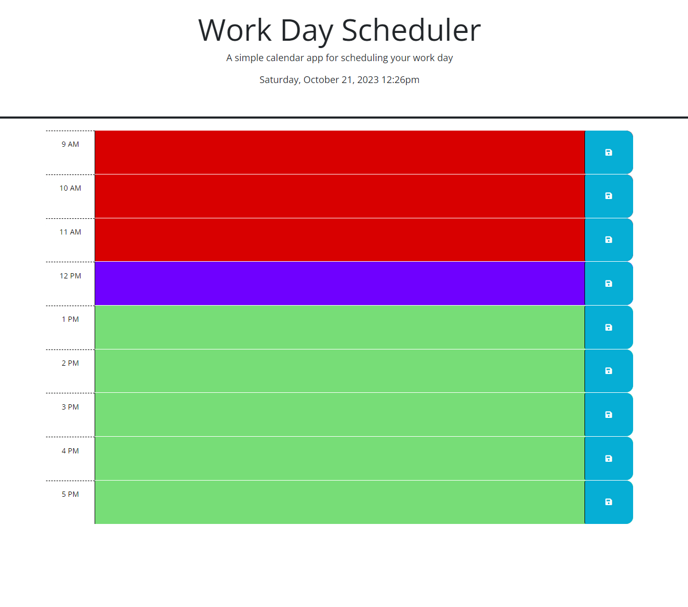

# Daily Planner
A basic calendar to keep track of daily tasks.

## Table of Contents
- [Project Overview](#project-overview)
- [Description](#description)
- [Screenshots](#screenshots)
- [Sources](#sources)

## Project Overview
This project was created with Javascript & jQuery to help users keep track of daily tasks.

## Description
Present events are colored purple, past events are colored red, and future events are colored green.
Each time box has a text box that will save to keep track of important events during the day.

## Screenshots
[Daily Planner](https://timbirict.github.io/Calender-App/)

## Sources

Dylan Osborn -TA

ChatGPT

Youtube.com

W3Schools.com

StackOverflow.com

Jquery.com
